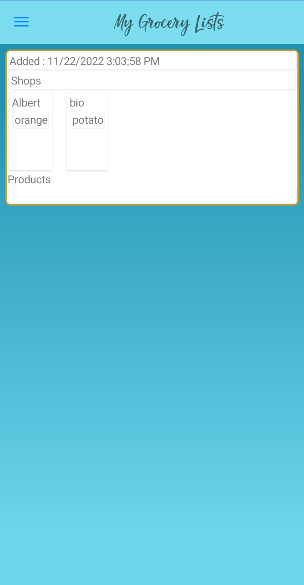
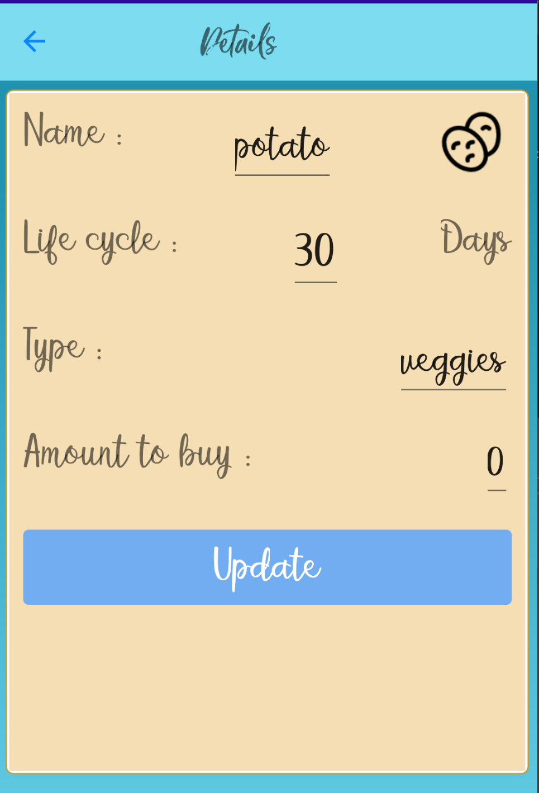
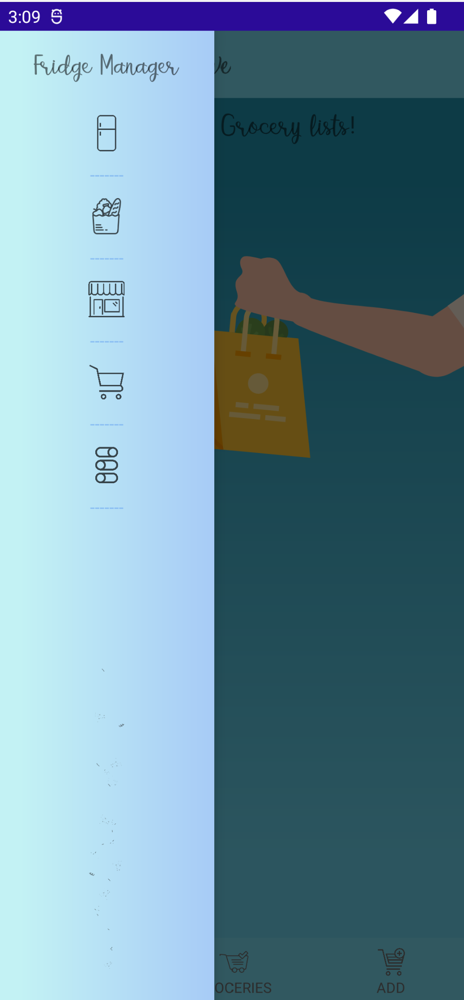
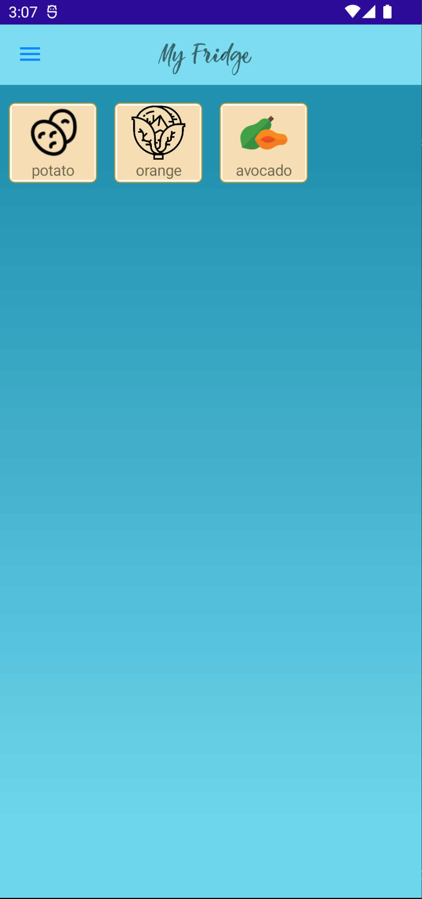

# Project C# Mobile 2022-2023
Naam en email: **Dimitriy Belshin - Dimitriy.Belshin@student.pxl.be**

Titel applicatie: **FridgeManager**

# Korte samenvatting van de app 
  Applicatie dient om boodschappenlijsten aan te maken en overzich/beheer van producten in je koelkast/ storage te hebben.
  Producten kan je creeren en groeperen in een winkels, icon aanpassen, levenstijd aanpassen en notificatie daarvan te krijgen.

# Opsomming belangrijkste kenmerken en onderdelen/features van de applicatie: 
* Boodschappenlijst aanmaak en hergebruik hiervan
* Notificatie van producten die over de datum zijn
* Aanmaak van nieuwe producten en hergebruik hiervan
* Aanmaak van winkel-groepen op een boodschaplijs
* Overzicht van producten die je ooit hebt gekocht en hergebruik daarvan
* Dient off en online te zijn

# Logboek
* 27/10/2022: Aanmaak van Views, Modelen, update van Nuggets, aanmaak van classe voor globale referenties.
* 28/10/2022: Aanmaak van Repositories, 
              leren betere begrip van AddScopedService, 
              Modelen Atributes voor SQLite,
              Lazy Instantiation van Globale Service Classe UnitOfWork,
              Creatie van Statische Classe voor globale data voornamelijk namen objecten zoals Routs.
* 29/10/2022: Begonnen met firebase database, 
              onderzoek van image locatie, 
              embedding en sourcing,
              proberen te begrijpen de issue met global styling van Shell
* 30/10/2022: Werk met animatie (SkiaSharp Library), Global fonts, 
              proberen te begrijpen Maui handlers en mappers, 
              werk met ITextStyle en Services.       
* 31/10/2022: Moest probleem oplossen met namespaces, 
              dus Framework en Main Project hermaken,
              problemen met SQLite "System.TypeInitializationException: The type initializer for 'SQLite.SQLiteConnection' threw an exception."
              probeer onderzoeken waar het vandaan komt
* 1/11/2022:  Heel veel zoeken waar werkt SQLite niet. 
              Probeerde oplossen Async werking van SQLite methode. 
              Het is gelukt. 
              Onderzocht en gemaak( geprobeerd ;) ) bindble flexlayout.
              Gewert op IRelayCommands in ViewModels
* 2/11/2022:  Gewerkt op ViewModels Commands en methoden, 
              Onderzoek van Trigger en CommonStates,
              Bezig met Bindings van Xaml Objecten,
              Controller Template proberen te implementeren
              om Product button te creeren.
* 7/11/2022:  Navigation Interface Created
              Editing menu CollectionView Header created
              Updated ProductDetailsViewModel 
* 8/11/2022:  ProductDetailsView gecreerd
              DateToOpacityConverter gecreerd
              MultipleSelection van CollectionView onderzocht
              en toegepast bij FridgeViewModel
              herstellen van per ongeluk verwijderd nugget record van F_Framework
              gecreerd NotificationsEdit helper class
              Updated AddingProductViewModel
              begon met ProductsView
* 9/11/2022:  OnAppearing EventtoCommand aangepast
              Updating en testen ViewModels van Producten
              Debugging FridgeViewModel en ProductViewModel
* 10/11/2022: Probeer bug oplossen van ContenViews die niet willen refreshen,
              probeerde fixen een probleem met opslaan van icon in app directory,
              nog niet gelukt, update van ProductNewViewModel,
              Update van nieuwe product toevoegen,
              Update van Shop views en viewmodels
* 11/11/2022: Begonen met GroceryView en GroceryViewModel,
              ontwikkeling van logica, gecreerd classen voor FireBase (json)
* 12/11/2022: blijf werken met GroceryView en GroceryViewModel,
              nu ook logica van xaml en views efficientie,
              gecreerd behavior voor Product Name Entry placeholder,
              updated GroceryNewView en GroceryNewViewModel
* 12/11/2022: Updated GroceriesAllView 
              Updated Helper GroceryFullGetter
              Updated GroceryViewModel
* 14/11/2022: Blijf werken met Groceries Views en ViewModels,
              SQLite debugging van het terugkrijging van Id's
* 16/11/2022: Updated InternetServices for 4 types en synchronisatie toegevoegd
              Drag&Drop gedeeltelijk geimplementeerd bij active Grocery lijst
* 17/11/2022: Update van styling
* 20/11/2022: Debug van Layouts en Database acties
* 21/11/2022: Synschronisation en Settings Allow Synch aangepast
              Groceries functies (Make Active, Add Product, Add Shop) toegepast
              Veel Debug van Interface en Empty View (die werkt nog steeds heel raar)
              Opgelost probleem met hoge frequency requests op SQLite CreateDatabaseAsync<T>
              Problemen met null en synchronisatie aan het oplossen
* 22/11/2022: Debug van synchronisatie
* 23/11/2022: Formatting the code with the help of pluggins
              Continue debug problems in logic of the code and null exeptions
* 28/11/2022: Update synchronisatie is gefixed, if's statements correct geplaats in AddOrUpdate methode
* 05/12/2022: Fix van Synchronisatie, in sommige gevallen las het niet de locale database.
* 26/12/2022: Implementatie van login en registratie voor merdere users.
* 27/12/2022: Fix van Synchronisatie, het werkte of synch van locaal db naar cloud of andersom.
* 28/12/2022: Fix van Synchronisatie. Video is gemaakt. Kleine update van interface voor mijn telefoon. De kleuren waren by default heel slecht zichtbaar.
* 30/12/2022: Synchronisatie is refactord en style nog een beethe aangepast. Ook statusbar kleur is aangepast. Rulse van de real database aangepast.
* 31/12/2022: Bug gefixed met producten toevoegen aan bestande active boodschaplijst.
              

# Optioneel: Screenshots
ScreenShot  1                   |  ScreenShot  2                      |  ScreenShot  3                    | ScreenShot  4    
:------------------------------:|:-----------------------------------:|:---------------------------------:|:------------------------------:
  |   |   |  

# Bronnen
* SQLite gebruik - https://www.youtube.com/watch?v=XFP8Np-uRWc&t=6s&ab_channel=JamesMontemagno
* Services: Scoped vs Singelton vs Transient - https://www.youtube.com/watch?v=01C8selSVCY&ab_channel=RawCoding  en Microsoft Documents 
* Repositories Structure - https://www.udemy.com/course/complete-aspnet-core-21-course/
* Lazy Initialization/Instantiation - https://learn.microsoft.com/en-us/dotnet/framework/performance/lazy-initialization
* Images in Xamarin - https://learn.microsoft.com/en-us/xamarin/xamarin-forms/user-interface/images?tabs=windows
* Images from Stream in Maui - https://www.youtube.com/watch?v=Wg1fhr3iwKY&ab_channel=GeraldVersluis
* Resource Dictionaries - https://learn.microsoft.com/en-us/dotnet/maui/fundamentals/resource-dictionaries
* SQLite Exeption Fix - https://stackoverflow.com/questions/46915404/the-type-initializer-for-sqlite-sqliteconnection-threw-an-exception
* SQLite Table Existens - https://stackoverflow.com/questions/39919769/is-it-possible-to-check-if-an-sqlite-table-exists
* FlexLayout Binding - https://stackoverflow.com/questions/60042290/how-can-i-bind-an-observable-collection-to-a-flexlayout-in-xamarin
* Grouping CollectionView binding - https://learn.microsoft.com/en-us/dotnet/maui/user-interface/controls/collectionview/grouping
* PullToRefresh - https://www.youtube.com/watch?v=invsT4ST1SI&ab_channel=GeraldVersluis
* Cyclomatic complexity - https://learn.microsoft.com/en-us/visualstudio/code-quality/code-metrics-cyclomatic-complexity?view=vs-2022
* Code metrics values - https://learn.microsoft.com/en-us/visualstudio/code-quality/code-metrics-values?view=vs-2022
* SQLite Id's Queries - https://stackoverflow.com/questions/66327759/correct-syntax-for-sqlite-queryt-for-xamarin-android
* Firebase queries - https://www.youtube.com/watch?v=LYAxYNN8s_s&ab_channel=ProgrammingWithPragnesh
* Drag & Drop Function - https://www.youtube.com/watch?v=xFXnkRmTKrI , https://learn.microsoft.com/en-us/dotnet/maui/fundamentals/gestures/drag-and-drop?view=net-maui-7.0
* PropertyChanged - https://stackoverflow.com/questions/901921/observablecollection-and-item-propertychanged, https://stackoverflow.com/questions/6007765/how-to-get-changes-in-observablecollection
* Performance Improvements - https://devblogs.microsoft.com/dotnet/performance-improvements-in-dotnet-maui/
* Firebase Authentication - https://www.youtube.com/watch?v=dGrh-z1G8lI&ab_channel=CodingWithZaidi
* Set Preferences - https://learn.microsoft.com/en-us/dotnet/maui/platform-integration/storage/preferences?view=net-maui-7.0&tabs=android
* Status Bar - https://www.youtube.com/watch?app=desktop&v=dWj0PdImH10&fbclid=IwAR3D3iiESlMAB1H5nPicC7R5-8zWLGes8gffCLVMpK2Ep6UsBTQD0rkL4_g&ab_channel=GeraldVersluis
* Firebase Rules - https://firebase.google.com/docs/rules/basics#realtime-database_1

## *Minimale vereisten**
* De applicatie dient ontwikkeld te worden in .NET MAUI voor zowel Android en/of iOS als Windows:
  Android alleen.
* De applicatie bevat minstens 5 schermen waar tussen genavigeerd kan worden: Zeker meer dan 5 :)
* Flyout en/of Tab navigatie dient voorzien te worden: Beide bestaan.
* De applicatie bevat een vorm van inloggen: Check
* Styles worden op minstens 4 plaatsen (her-)gebruikt en worden beschikbaar gemaakt in App.xaml:
  Style TargetType="Page" in Colors.xaml.
* Er is minstens 1 CollectionView waarbij selectie voorzien wordt om detailinformatie van het
  geselecteerd item op te vragen: Bestaan meerdere
* Er kan gefilterd (zoekterm, soort, �) of gerangschikt (grootte, prijs, rating, �) worden op de
  elementen in de lijst. Een andere manier van interactie kan ook goedgekeurd worden: Bestaat gedeeltelijk.
  Er zijn typen van producten en UsageAmount van boodschaplijst en die werken, maar ik heb geen interface 
  hiervoor gemaakt.
* De applicatie bevat een settingspagina: Bestaat met Synchronisatie, Allow online usage en outloggen.
* Data binding wordt op verschillende plaatsen in de applicatie correct toegepast en kan worden
  geduid: Check 
* De applicatie bevat compiled bindings: Check
* Er is minstens ��n nuttige converter �n behavior: 
  Converters: DateToOpacityConverter, ProductIsDoneToOpacity.
  Behaviors: PlaceholderProducts
* Het MVVM patroon is aanwezig in de applicatie en de verschillende componenten kunnen worden
  benoemd: Check
* Er wordt gebruik gemaakt van minstens ��n externe library: 
  CommunityToolkit Maui en Mvvm, Firebase Database en Authorisation, Plugin.LocalNotification, SkiaSharp.Extended.UI.Maui, SQLite
* Externe data ophalen/bewaren: Firebase en SQLite
� De applicatie bevat een SQLite database met basis functionaliteit (lezen, updaten, aanmaken en
verwijderen) voor zelf gedefinieerde objecten (modelklassen): Check

## *Extra's'**

� Logo applicatie en of custom splash screen bij het opstarten: Check voor beide
� Geavanceerde queries op de database (zoekfunctionaliteit, meerdere tabellen met joins, �): 
  Logica en Synchronisatie, Online en offline queries en logica van welke wanneer moet werken, 
  Structuur van UnitOfWork, implementatie van Lazy manier van objecten. GetLast query. Maui Class Framework
� Geavanceerde CollectionView implementeren met bijvoorbeeld context menu�s, pull to
  refresh, grouping,�: Triggers, pull to refresh, complexe databinding tussen elementen van View.
� Geavanceerde vorm van MVVM gebruiken: Commands, Behaviors, Services, Messaging: IRelayCommandsAsync, custom INavigation, 
  apparte services die inclusief zijn in UnitOfWork structuur, Services Transient en Singelton, Sort van Custom Controll maar zonder costum parameters 
  (ProductController is niet in gebruik, wel voor later gaat dienen, daarom heb ik het niet weg gegooid).
� Implementeren van gestures interactie zoals bijvoorbeeld Drag&Drop, Pan, Swipe: Swipe, Drag&Drop, Pull to refresh.
� Mooie layouts integreren/nabouwen eventueel m.b.v. externe toolkits : Animations, color gradations en een kleine custom controller zonder custom properties.
� Andere extra�s zijn zeker mogelijk, gelieve dit in het document aan te geven ter goedkeuring
